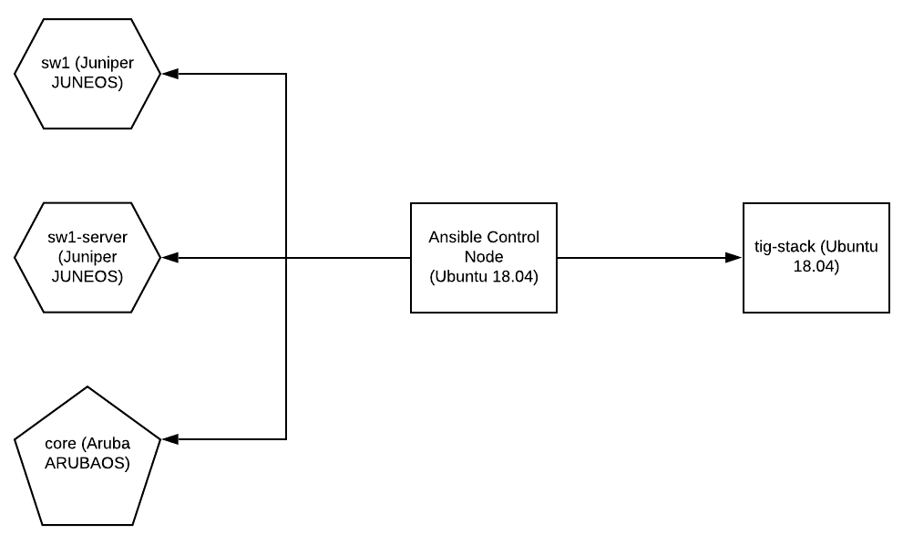

## Ansible examples

Clone this repository and use the guides in the [docs](docs) folder to try out real world examples of how to use ansible to configure aruba/juniper switches, and linux hosts.

### Assumptions

#### Devices

Devices being used are:

1. Juniper EX-2200 - JUNOS 15.1R6.7
2. Aruba 2930F - WC.16.08.0012
3. Ubuntu Linux - 18.04

#### Knowledge

- SSH key installed on Juniper switches
- Familiarity with `bash` and the linux command line
- Familiarity with `ansible` and general concepts of automation
- Ansible control machine and tig-stack target machine have been installed with a username and password
- VM snapshot has been taken of the tig-stack in order to be rolled back between guides 1 and 3

### Topology

  

### Guides

All guides are located in the [docs](docs) directory, and should be completed in the following order:

1. [Manual tig-stack setup](docs/manual-tig-stack-setup.md)
2. [Ansible control machine setup](docs/ansible-control-machine-setup.md)
3. [Deploy ssh key](docs/deploy-ssh-key.md)
4. [Ansible tig-stack setup](docs/ansible-tig-stack-setup.md)
5. [Juniper syslog](docs/juniper-syslog.md)
6. [Aruba syslog](docs/aruba-syslog.md)
